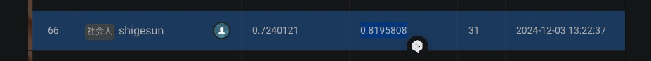

# SMBC Group GREEN×DATA Challenge 2024

本リポジトリは、[SIGNATE上で開催された「SMBC Group GREEN×DATA Challenge 2024」](https://signate.jp/competitions/1491)での取り組みをまとめたポートフォリオです。

- **最終順位**: 800人中66位 (上位約8.25%)  
- **モデル**: XGBoostを用いた回帰モデル  
- **評価指標**: RMSLE

## リポジトリ内容

- `SMBC_Group_GREENxDATA_Challenge_2024_Notebook.ipynb`:  
  Google Colab上で実行可能なNotebook。特徴量エンジニアリング、モデル学習、評価、特徴量重要度の可視化などを行っています。

- `images/SMBC_GREENxDATA_66th_place.png`:  
  コンペ参加時の66位達成を証明するスクリーンショット。

- `data/`ディレクトリ:  
  `train.csv`, `test.csv`, `sample_submission.csv`を配置してください。  
  *注: データはコンペの利用規約に従い管理し、公開不可の場合は利用者各自でダウンロードし`data/`内に設置してください。

## Notebook実行手順

1. Google Colabを開き、このリポジトリから`SMBC_Group_GREENxDATA_Challenge_2024_Notebook.ipynb`をアップロードまたはGitHub連携で開く。
2. Notebook冒頭の`pip install`セルを実行し、`xgboost`と`lightgbm`をインストール。
3. `data/`ディレクトリに配置した`train.csv`, `test.csv`, `sample_submission.csv`をGoogle Driveにアップロードし、Notebook内のパスを書き換えます。
4. セルを上から順に実行すると、モデル学習・評価が行われ、`submission_SMBC_GREENxDATA.csv`が出力されます。

## 66位証拠画像

下記はコンペリーダーボードのスクリーンショットです。

